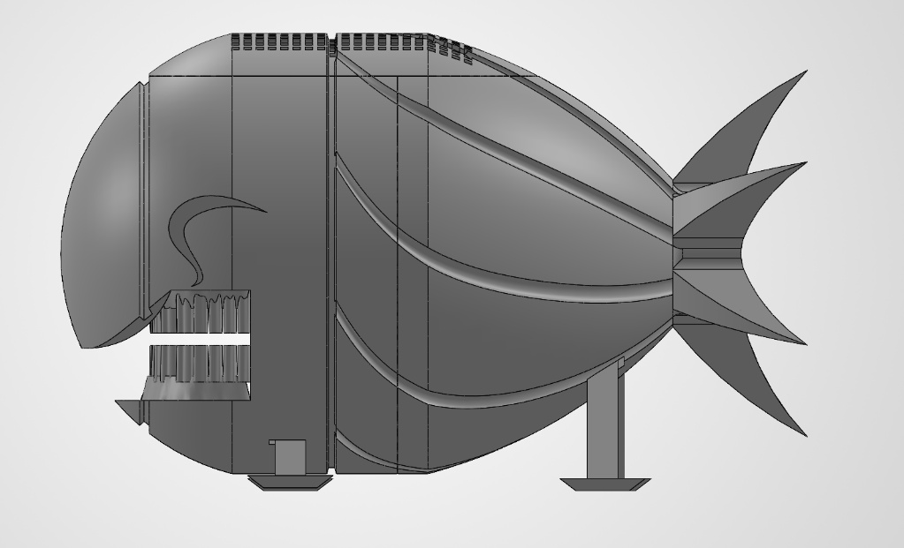
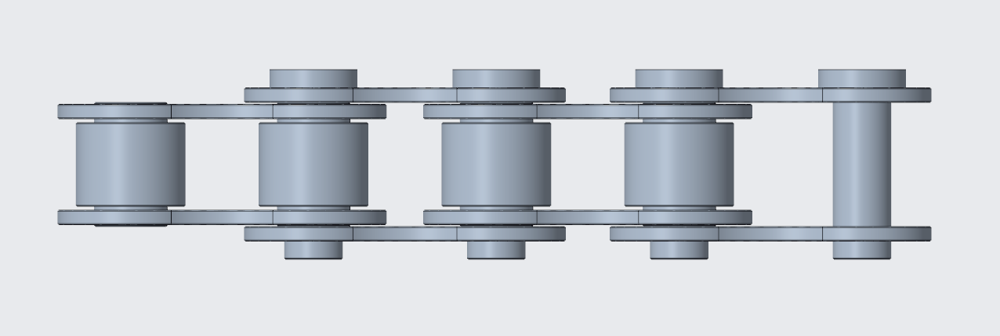
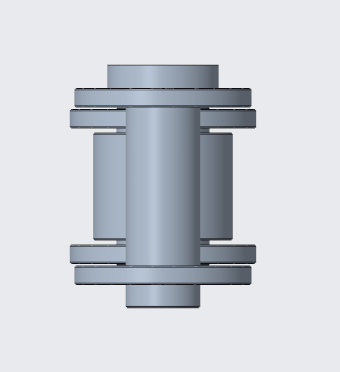
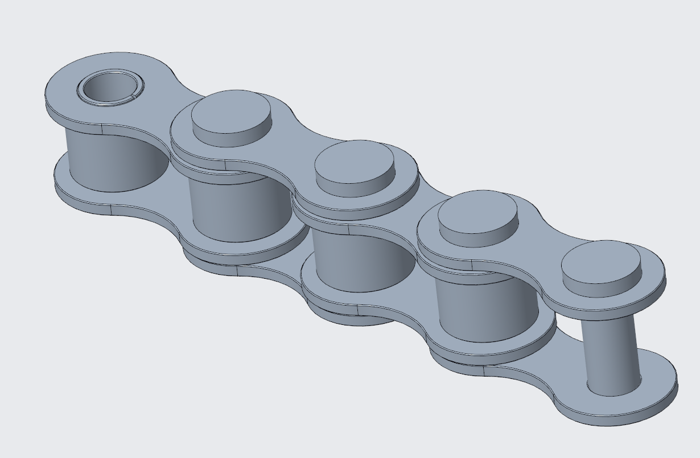
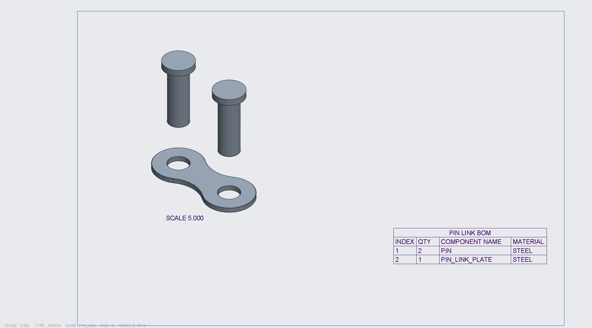
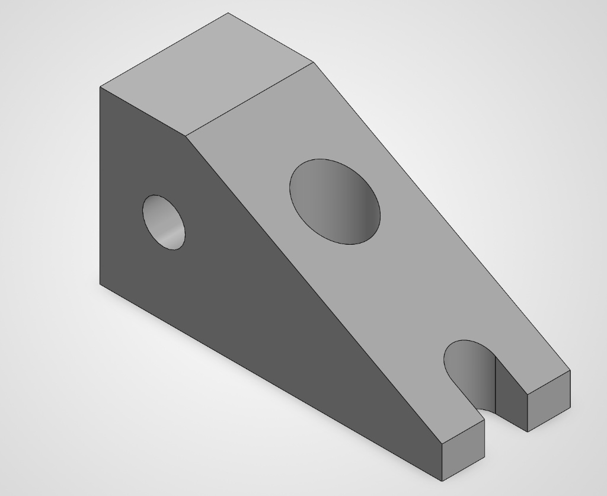
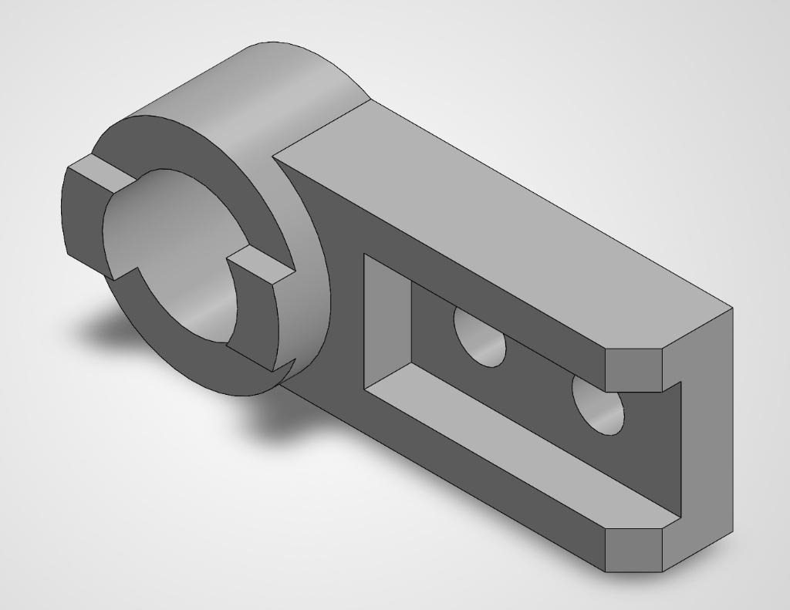
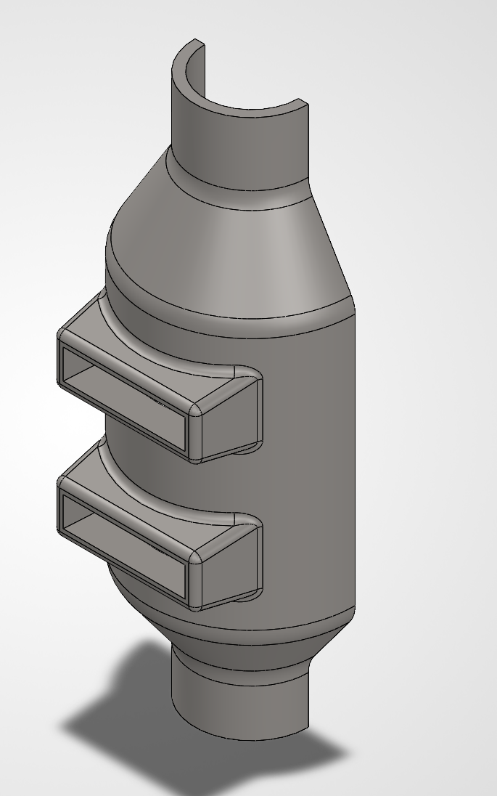
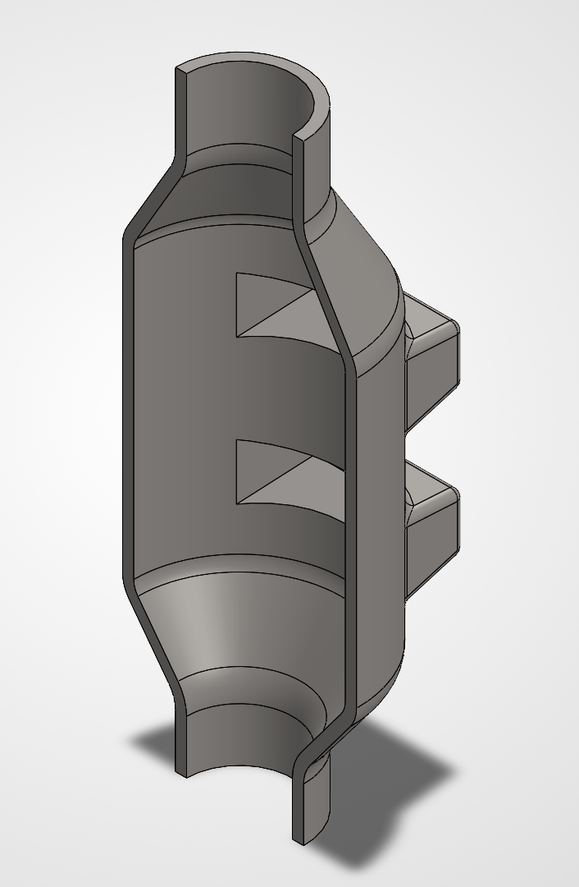
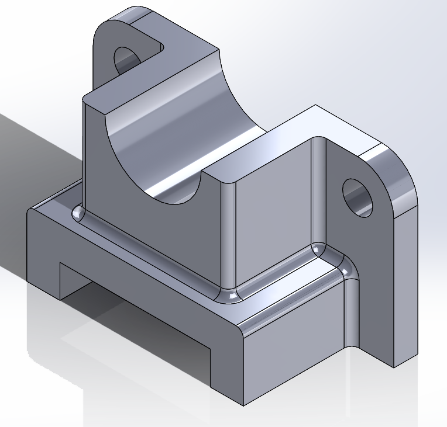

# Engineering CAD Portfolio & CAD Model Library

A comprehensive engineering portfolio featuring mechanical CAD models, complex sub-assemblies, motion analysis, industrial tooling, advanced surface designs, and parametric hardware modeled in SolidWorks and PTC Creo.

---

## Technical Overview

* **CAD Systems:** SolidWorks, PTC Creo
* **Core Competencies:**
  * Advanced Surface Modeling & Swept Guide-Curve Design
  * Bottom-Up & Top-Down Mechanical Assembly Modeling
  * Kinematic Mechanism Simulation & Motion Analysis (Displacement, Velocity, Acceleration)
  * Design for Manufacturing & Assembly (DFMA) & Additive Manufacturing (DfAM)
  * Production Drafting, GD&T, Detailing & Bill of Materials (BOM) Generation

---

## Featured Flagship Projects

### 1. Organic Shell Enclosure ("Fish Assembly") (SolidWorks)
An advanced freeform surfacing project demonstrating complex curved outer shell geometry, swept guide curves, internal snap-mating lip slots, precision alignment tabs, custom textured knurling across the upper panel, and multi-part assembly tolerances.

| Isometric View | Front View | Right Side View | Bottom View | Rear View |
| :---: | :---: | :---: | :---: | :---: |
|  |  |  |  |  |

| Exploded Assembly Layout 01 | Exploded Assembly Layout 02 |
| :---: | :---: |
|  |  |

---

### 2. Roller Chain Assembly & Production Drawings (PTC Creo)
A multi-component power transmission assembly modeled in Creo, including sub-assemblies (`ROLLER_CHAIN`, `PIN_LINK`), full assembly mates, exploded configurations, and complete engineering drawings with BOMs.

| Front View | Side View | Isometric View | Assembly Drawing Sheet |
| :---: | :---: | :---: | :---: |
|  |  |  |  |

| Pin Link Sub-Assembly Drawing | Roller Link Sub-Assembly Drawing |
| :---: | :---: |
|  |  |

---

### 3. Klann Linkage Walking Mechanism (SolidWorks)
A spider-leg mechanical walking linkage featuring motion simulation, path tracing, displacement plots, and kinematic velocity/acceleration analysis.

| Isometric View | Trace Path View | Kinematic Motion Analysis Plots |
| :---: | :---: | :---: |
|  |  |  |

---

## Kinematic Mechanisms & Complex Assemblies

* **Four-Cylinder Crankshaft Assembly** *(SolidWorks)*
  * Internal combustion crankshaft assembly with balanced counterweights and journal mates (`four_cylinder_crankshaft_iso.png`, `four_cylinder_crankshaft_front_view.png`, `four_cylinder_crankshaft_top_view.png`).
* **Geneva Cam Intermittent Mechanism** *(SolidWorks)*
  * Indexing drive complete with exploded state layouts and top/bottom motion views (`geneva_cam_assembly_iso.png`, `geneva_cam_assembly_exploded.png`, `geneva_cam_assembly_top.png`).
* **Retractable Aircraft Landing Gear** *(SolidWorks)*
  * Aerospace linkage mechanism featuring structural struts and deployment positioning renders (`landing_gear_render_iso.jpg`, `landing_gear_iso.jpg`, `landing_gear_front.png`).
* **Predator Drone UAV** *(SolidWorks)*
  * Aerodynamic fuselage, wing structure, and exploded assembly layout (`predator_drone_iso_front.jpg`, `predator_drone_exploded.jpg`, `predator_drone_side.png`).
* **Car Wheel & Tread Assembly** *(SolidWorks)*
  * Multi-piece automotive wheel assembly including rim, tire tread, and exploded configurations (`car_wheel_assembly_iso.png`, `car_wheel_exploded.jpg`, `car_wheel_assembly_tread.png`).
* **Pulley Drive Assembly with BOM** *(SolidWorks)*
  * Belt drive assembly featuring an integrated Bill of Materials table and exploded structure (`pulley_assembly_iso.png`, `pulley_assembly_exploded_bom.jpg`, `pulley_assembly_bom_table.png`).
* **Double & Universal Joints** *(SolidWorks)*
  * Angular power transmission joint mechanisms (`double_ujoint_assembly_iso.png`, `universal_joint_exploded.jpg`).
* **Deep-Groove Ball Bearing Assembly** *(SolidWorks)*
  * Inner/outer race assembly with cage retainer and rolling elements (`ball_bearing_assembly_iso_front.png`, `ball_bearing_assembly_exploded.jpg`).
* **Swing Table Assembly** *(SolidWorks)*
  * Dynamic swinging table mechanism with production drawings and exploded renders (`swing_table_assembly_render_iso.png`, `swing_table_assembly_render_exploded.png`, `swing_table_assembly_drawing.PNG`).
* **Roller Assembly** *(SolidWorks)*
  * Heavy-duty roller support with assembly drafting and isometric renders (`roller_assembly_render_iso.JPG`, `roller_assembly_exploded.jpg`, `roller_assembly_drawing.PNG`).
* **Fixture & Milling Assemblies** *(SolidWorks)*
  * Machining fixtures and workholding setups (`fixture_assembly_iso.jpg`, `fixture_assembly_exploded.png`, `milling_fixture_iso.png`).

---

## Industrial Tooling, Housing Covers & Machine Parts

| Part Name | Primary View | Alternative / Drawing View |
| :--- | :---: | :---: |
| **Housing Cover** |  |  |
| **Pump Housing** |  |  |
| **Mount Block** |  |  |
| **Shaft Mount** |  |  |
| **Pump Cover** |  |  |
| **Enclosure Cover** |  |  |
| **Plenum & Ducting** |  |  |
| **Bearing Block** |  |  |

---

## Brackets, Joints & Structural Support Hardware

* **Anchor Brackets:** `anchor_bracket_iso.png`, `anchor_bracket_iso_alt.png`, `anchor_bracket_top.png`, `anchor_bracket_bottom.png`
* **Angled Brackets & Joints:** `angled_bracket_iso.png`, `angled_bracket_iso_rear.png`, `angled_joint_iso_front.png`, `angled_joint_iso_rear.png`
* **Mounting & Corner Brackets:** `mounting_bracket_iso.png`, `mounting_bracket_iso_back.png`, `corner_bracket_iso.png`, `corner_bracket_front.png`
* **Shaft & Base Supports:** `shaft_support_iso.png`, `base_support_creo_iso.png`, `support_base_iso.png`, `track_mount_iso.png`
* **Slide Joints & Idler Arms:** `slide_joint_iso.png`, `idler_arm_iso.png`

---

## Hardware, Fasteners, Springs & Fluid Components

* **Springs:** Barrel Springs (`barrel_spring_iso.png`), Extension Springs (`extension_spring_creo_iso.png`).
* **Fasteners & Hardware:** Hex Bolts (`hex_bolt_iso.png`), Cotter Pins (`cotter_pin_iso.jpg`), Stepped Bushings (`stepped_bushing_iso.png`), Cable Clips (`cable_clip_iso.png`, `cable_clip_slicer_iso.png`).
* **Pulleys & Turbines:** Belt Pulley (`belt_pulley_iso.png`), Pulley Revolve (`pulley_revolve_iso.png`), Dual Impeller (`dual_impeller_iso.png`), Turbine Wheel (`turbine_wheel_iso.png`), Sprinkler (`sprinkler_iso.png`).
* **Piping & Manifolds:** Flanged Pipe (`flanged_pipe_iso.png`), Pipe Sweep (`pipe_sweep_iso.png`), Shelled Manifold (`shelled_manifold_iso.png`).

---

## Consumer Products & Surface Models

* **Creo Razor Handle:** Ergonomic contoured handle (`razor_handle_creo_iso.png`, `razor_handle_creo_side.png`).
* **Molded Handle:** High-friction grip enclosure (`molded_handle_iso.jpg`, `molded_handle_rear_iso.jpg`).
* **Door Handle & Card Holder:** Architectural hardware (`door_handle_iso.jpg`, `creo_card_holder_iso.png`).
* **Cooling Fan & Vacuum Nozzle:** Aerodynamic blade & suction flow geometries (`cooling_fan_iso.jpg`, `vacuum_nozzle_iso.jpg`).
* **Basketball Rim & Soccer Ball:** Parametric sports equipment models (`basketball_rim_creo_iso.png`, `soccer_ball_iso.png`).
* **Lifting Hook & Keychains:** Structural lifting components & promotional items (`lifting_hook_iso.png`, `laughing_coffin_keychain_iso.png`).
